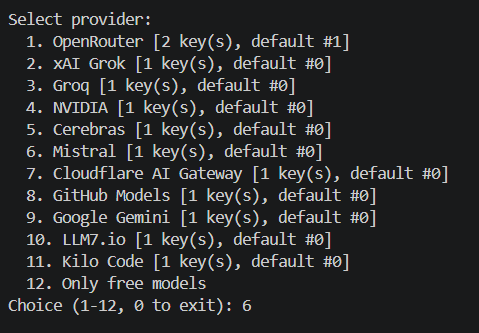
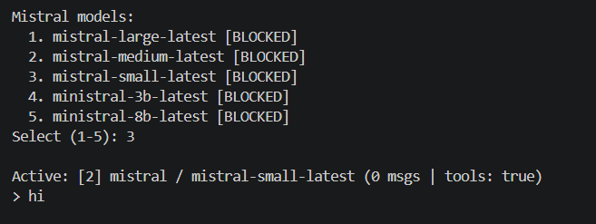
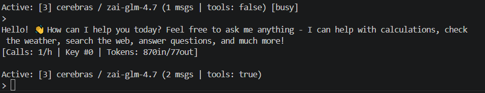

# FilosoIA

> **ES:** Asistente de IA para programación desde la terminal — multicliente con tools (leer/escribir archivos, ejecutar comandos, buscar en la web) y más de 11 proveedores.
> **EN:** AI coding assistant for the terminal — multi-provider client with tools (read/write files, run commands, web search) and 11+ providers.

---

## Screenshots / Capturas

### 1. Provider selection / Selección de proveedor



**ES:** Menú principal donde elegís entre 11 proveedores: OpenRouter, xAI Grok, Groq, NVIDIA, Cerebras, Mistral, Cloudflare AI Gateway, GitHub Models, Google Gemini, LLM7.io y Kilo Code. También podés filtrar solo modelos gratuitos (opción 12).

**EN:** Main menu where you choose from 11 providers: OpenRouter, xAI Grok, Groq, NVIDIA, Cerebras, Mistral, Cloudflare AI Gateway, GitHub Models, Google Gemini, LLM7.io, and Kilo Code. You can also filter only free models (option 12).

### 2. Model selection / Selección de modelo



**ES:** Cada proveedor muestra su lista de modelos disponibles. Podés marcar modelos como bloqueados (`/nofree`) y agregar modelos personalizados (`/models add`). Las API keys se guardan cifradas y rotan automáticamente si fallan.

**EN:** Each provider shows its available model list. You can block models (`/nofree`) and add custom ones (`/models add`). API keys are stored encrypted and auto-rotate on failure.

### 3. Coding session / Sesión de programación



**ES:** El asistente usa function calling para leer archivos, escribir código, ejecutar comandos y buscar en la web — todo desde el chat, con sesiones múltiples, tracking de tokens y rate limiting.

**EN:** The assistant uses function calling to read files, write code, run commands, and search the web — all from the chat, with multiple sessions, token tracking, and rate limiting.

---

## Tools / Herramientas

| Tool | ES | EN |
|---|---|---|
| `read_file` | Leer archivos del proyecto | Read project files |
| `write_file` | Escribir/editar/insertar/reemplazar líneas | Write/edit/insert/replace lines |
| `run_command` | Ejecutar comandos (sandbox) | Run shell commands (sandboxed) |
| `web_search` | Buscar en la web (DuckDuckGo) | Search the web (DuckDuckGo) |
| `calculator` | Evaluar expresiones matemáticas | Evaluate math expressions |
| `get_time` | Obtener fecha y hora actual | Get current date and time |
| `get_weather` | Consultar clima de una ciudad | Check weather for a city |

---

## Features / Características

| ES | EN |
|---|---|
| **11 proveedores** de IA en un solo menú | **11 providers** in a single menu |
| **Tools de coding**: leer/escribir archivos, terminal, web | **Coding tools**: read/write files, terminal, web |
| **API keys cifradas** con AES-GCM + Argon2 | **Encrypted API keys** with AES-GCM + Argon2 |
| **Múltiples sesiones** simultáneas | **Multiple simultaneous sessions**, switch by number |
| **Rate limiting** automático con cooldown | **Automatic rate limiting** with cooldown on 5xx |
| **Rotación de keys** ante errores 401/403 | **Key rotation** on 401/403 errors |
| **Tool calling / function calling** integrado | **Built-in tool calling / function calling** |
| **Tracking de tokens** por proveedor | **Token tracking** per provider |
| **Modelos gratuitos** preconfigurados | **Preconfigured free models** |

---

## Commands / Comandos

| Command | ES | EN |
|---|---|---|
| `/help` | Ayuda | Help |
| `/keys` | Listar/agregar/remover keys | List/add/remove keys |
| `/config` | Ver configuración y estado | View config & status |
| `/nofree` | Bloquear modelo | Block model |
| `/free` | Desbloquear modelo | Unblock model |
| `/list` | Listar sesiones activas | List active sessions |
| `/switch <N>` | Cambiar a sesión N | Switch to session N |
| `/close <N>` | Cerrar sesión N | Close session N |
| `/models` | Listar/agregar modelos personalizados | List/add custom models |
| `menu` | Volver al menú de proveedores | Back to provider menu |
| `quit` / `exit` | Salir | Exit |

---

## Build & run / Compilar y ejecutar

```bash
cargo run --release
```

**ES:** La primera vez te va a pedir una clave maestra para cifrar las API keys. Dejá vacío si no querés cifrado.

**EN:** On first run it will ask for a master password to encrypt API keys. Leave empty if you don't want encryption.

---

## Supported providers / Proveedores soportados

| # | Provider | Get API key |
|---|---|---|
| 1 | OpenRouter | `openrouter.ai` |
| 2 | xAI Grok | `x.ai` |
| 3 | Groq | `console.groq.com` |
| 4 | NVIDIA | `build.nvidia.com` |
| 5 | Cerebras | `cloud.cerebras.ai` |
| 6 | Mistral | `console.mistral.ai` |
| 7 | Cloudflare AI Gateway | `cloudflare.com` |
| 8 | GitHub Models | `github.com/settings/tokens` |
| 9 | Google Gemini | `aistudio.google.com` |
| 10 | LLM7.io | `token.llm7.io` |
| 11 | Kilo Code | `app.kilo.ai` |
